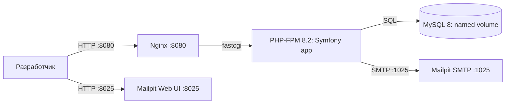

# Design: initial-docker-setup

## Context

Репозиторий пустой — кода и окружения нет (ADR-0000). Целевой стек:
Symfony 6.x, PHP 8.2+, Doctrine ORM, Twig, Webpack Encore, MySQL. Мотивация и
скоуп — в `proposal.md`. Дизайн ограничивается локальным dev-окружением:
прод-деплой, CI и реальный SMTP выходят за рамки (ADR-0010).

## Goals / Non-Goals

**Goals:**
- Воспроизводимое локальное окружение одной командой (`docker compose up`).
- Рабочее Symfony-приложение (PHP 8.2+), подключённые Doctrine ORM и
  Symfony Mailer, зависимости через Composer.
- MySQL с начальной миграцией схемы; отдельный контейнер dev-SMTP (Mailpit)
  с веб-интерфейсом просмотра писем.
- Fixtures: пользователи (admin, менеджеры), группы (`user-<id>-group`,
  custom), организации, контакты, запланированные звонки.

**Non-Goals:**
- Prod-развёртывание и HTTPS/TLS.
- CI/CD пайплайн и автоматизированные тесты.
- Реальный SMTP доставщик (переносится на ADR-0010/outbox).
- Node/Webpack Encore в compose — добавляется вместе с UI-работами
  (roadmap, шаг 3).

## Decisions

### D1. Сервисы: php-fpm + nginx + mysql + mailpit

`docker compose` с четырьмя сервисами: `php` (php-fpm + Symfony приложение),
`nginx` (front-контейнер, отдаёт статику и проксирует на php-fpm), `mysql`
(БД с volume для персистентности) и `mailpit` (dev-SMTP :1025 + web UI :8025).

- **Почему nginx, а не встроенный сервер PHP:** окружение повторяет
  prod-схему (nginx → php-fpm), что упрощает переход к деплою; встроенный
  сервер не обслуживает статику и asset-ы эффективно, а после появления
  Webpack Encore (roadmap, шаг 3) nginx всё равно потребуется.
- **Альтернативы:** только php-fpm со встроенным сервером (`symfony
  serve`) — отклонено: асимметрия с продом, вопросы со статикой; готовый
  образ `symfony/skeleton` — отклонено: меньше контроля над версиями PHP
  и расширений.

### D2. Базовый образ: официальный `php:8.2-fpm`, расширения для Symfony/Doctrine

Один `Dockerfile` от `php:8.2-fpm` (debian bookworm): `pdo_mysql`,
`intl`, `zip`, `opcache` (dev — отключена/лёгкая), `composer` (официальный
образ, копируется бинарём). Код монтируется bind-mount'ом, `composer
install` выполняется при старте контейнера (или npm-аналог не нужен).

- **Почему не multi-stage и не сборка на build:** dev-режим — код меняется
  непрерывно; bind-mount + `composer install` в entrypoint'е даёт «поднял →
  работает» без пересборки при каждом изменении зависимостей.
- **Альтернативы:** Dockerfile, собирающий зависимости на билде
  (`composer install` в image) — отклонено: пересборка на каждое изменение
  `composer.json`; образ `symfony-docker` от сообщества — отклонено:
  внешняя поддержка и нестабильные теги.

### D3. MySQL 8.x: healthcheck + persistent volume, конфиг через .env

Сервис `mysql` с официальным образом 8.x, `MYSQL_DATABASE/MYSQL_USER/
MYSQL_PASSWORD` из `.env` (локальные значения, в git не коммитятся;
шаблон `.env.example` — коммитится). `healthcheck` для порядка старта
сервисов, named volume для `/var/lib/mysql`.

- **Почему healthcheck, а не `depends_on` без условий:** гарантирует, что
  сервер БД принял подключения, прежде чем миграции/fixtures начнут
  работу; `depends_on` сам по себе ждёт только старта контейнера.
- **Альтернативы:** SQLite для dev — отклонено: несоответствие прод-БД и
  расхождения в типах/поведении.

### D4. Mailpit как dev-SMTP, `MAILER_DSN` из compose-переменных

Сервис `mailpit` (образ `axllent/mailpit`): принимает SMTP на `:1025`,
web UI на `:8025`. `MAILER_DSN=smtp://mailpit:1025` задаётся в сервисе
`php`. Реальный SMTP и outbox-модель со статусами писем — не в этом
изменении (ADR-0010).

- **Почему Mailpit, а не Mailhog/Mailcatcher:** активная поддержка,
  веб-интерфейс и REST API для проверки писем; Mailhog — заброшенный.
- **Альтернативы:** пустой dev-SMTP без UI — отклонено: без интерфейса
  неудобно проверять письма рассылок на раннем этапе.

### D5. Развёртывание схемы и данных: entrypoint `php` + Makefile

Команды `composer install`, `doctrine:migrations:migrate --no-interaction`
и опционально `doctrine:fixtures:load` выполняются скриптом при старте
`php`-контейнера (идемпотентно). Для повторного запуска/пересоздания —
Makefile‑таргеты (`make up`, `make migrate`, `make fixtures`, `make down`).

- **Почему скрипт в entrypoint, а не ручные команды:** новая машина
  разработчика должна получать рабочее окружение одной командой (ADR-0000).
- **Альтернативы:** инструкция в README с ручными шагами — отклонено:
  противоречит цели «одной командой»; отдельный init-контейнер —
  отклонено: избыточно для dev-режима.

## Диаграмма (C4, уровень container; Mermaid)

Границы: все контейнеры — dev-окружение (`docker compose up`), изоляция по
сети compose. Предположение: порты хост-машины `8080/8025/3306`
конфигурируются через `.env` при конфликтах.

## Risks / Trade-offs

- [Конфликт портов на хост-машине] → все проброшенные порты вынесены в
  `.env` (переопределяются без правки файлов).
- [Права/пермишены bind-mount'а (uid контейнера vs пользователя)] →
  фиксированный uid в `Dockerfile` + инструкция в README; при проблемах —
  переопределение uid через переменную.
- [Дрейф версий образов со временем] → версии образов закрепляются
  тегами в `compose.yaml` (не `latest`).
- [Mailpit не покрывает реальный SMTP-сценарий] → осознанное ограничение;
  закрывается ADR-0010 (outbox, per-letter статусы), schema данных
  закладывается в миграциях.
- [Автозапуск миграций в entrypoint может маскировать ошибки схемы] →
  логирование шагов, идемпотентные команды, явный `make migrate` для
  разработчика.

## Migration Plan

Репозиторий пустой — развёртывание равно первым шагам проекта: `docker
compose up --build` поднимает окружение, entrypoint выполняет `composer
install` → миграции → fixtures. Откат: `docker compose down -v` (удаляет
volume с БД) + `git revert` при необходимости. Прод не затрагивается.

## Open Questions

- Нужен ли отдельный сервис Node для Webpack Encore в текущем скоупе? —
  отложено сознательно: UI-работа начнётся на roadmap-шаге 3, тогда и
  добавится `node`-сервис (изменение не затронет принятые здесь решения).
- Версия MySQL-образа (8.0 vs 8.4)? — фиксируется конкретным тегом в
  `compose.yaml` на этапе реализации tasks; на структуру дизайна не влияет.