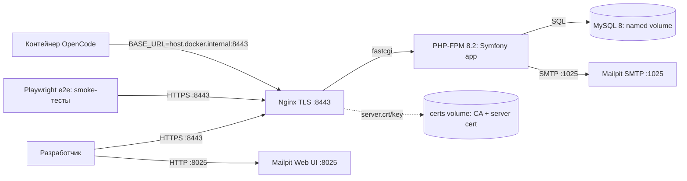

# Design: initial-docker-setup

## Context

Репозиторий пустой — кода и окружения нет (ADR-0000). Целевой стек:
Symfony 6.x, PHP 8.2+, Doctrine ORM, Twig, Webpack Encore, MySQL. Мотивация и
скоуп — в `proposal.md`. Дизайн ограничивается локальным dev-окружением:
прод-деплой, CI и реальный SMTP выходят за рамки (ADR-0010).

## Goals / Non-Goals

**Goals:**
- Воспроизводимое локальное окружение одной командой (`docker compose up`).
- Рабочее Symfony-приложение (PHP 8.2+), подключённые Doctrine ORM и
  Symfony Mailer, зависимости через Composer.
- MySQL с начальной миграцией схемы; отдельный контейнер dev-SMTP (Mailpit)
  с веб-интерфейсом просмотра писем.
- Fixtures: пользователи (admin, менеджеры), группы (`user-<id>-group`,
  custom), организации, контакты, запланированные звонки.

**Non-Goals:**
- Prod-развёртывание и HTTPS/TLS.
- CI/CD пайплайн и автоматизированные тесты.
- Реальный SMTP доставщик (переносится на ADR-0010/outbox).
- Node/Webpack Encore в compose — добавляется вместе с UI-работами
  (roadmap, шаг 3).

## Decisions

### D1. Сервисы: php-fpm + nginx + mysql + mailpit + e2e

`docker compose` с пятью сервисами: `php` (php-fpm + Symfony приложение),
`nginx` (front-контейнер, TLS-терминация, отдаёт статику и проксирует на
php-fpm), `mysql` (БД с volume для персистентности), `mailpit` (dev-SMTP
:1025 + web UI :8025) и `e2e` (Playwright, запуск по требованию, см. D7).

- **Почему nginx, а не встроенный сервер PHP:** окружение повторяет
  prod-схему (nginx → php-fpm), что упрощает переход к деплою; встроенный
  сервер не обслуживает статику и asset-ы эффективно, а после появления
  Webpack Encore (roadmap, шаг 3) nginx всё равно потребуется.
- **Альтернативы:** только php-fpm со встроенным сервером (`symfony
  serve`) — отклонено: асимметрия с продом, вопросы со статикой; готовый
  образ `symfony/skeleton` — отклонено: меньше контроля над версиями PHP
  и расширений.

### D2. Базовый образ: официальный `php:8.2-fpm`, расширения для Symfony/Doctrine

Один `Dockerfile` от `php:8.2-fpm` (debian bookworm): `pdo_mysql`,
`intl`, `zip`, `opcache` (dev — отключена/лёгкая), `composer` (официальный
образ, копируется бинарём), а также скрипты `docker/gen-certs.sh`
(генерация сертификатов, см. D6) и entrypoint (см. D5). Код монтируется
bind-mount'ом, `composer install` выполняется при старте контейнера.

- **Почему не multi-stage и не сборка на build:** dev-режим — код меняется
  непрерывно; bind-mount + `composer install` в entrypoint'е даёт «поднял →
  работает» без пересборки при каждом изменении зависимостей.
- **Альтернативы:** Dockerfile, собирающий зависимости на билде
  (`composer install` в image) — отклонено: пересборка на каждое изменение
  `composer.json`; образ `symfony-docker` от сообщества — отклонено:
  внешняя поддержка и нестабильные теги.

### D3. MySQL 8.x: healthcheck + persistent volume, конфиг через .env

Сервис `mysql` с официальным образом 8.x, `MYSQL_DATABASE/MYSQL_USER/
MYSQL_PASSWORD` из `.env` (локальные значения, в git не коммитятся;
шаблон `.env.example` — коммитится). `healthcheck` для порядка старта
сервисов, named volume для `/var/lib/mysql`.

- **Почему healthcheck, а не `depends_on` без условий:** гарантирует, что
  сервер БД принял подключения, прежде чем миграции/fixtures начнут
  работу; `depends_on` сам по себе ждёт только старта контейнера.
- **Альтернативы:** SQLite для dev — отклонено: несоответствие прод-БД и
  расхождения в типах/поведении.

### D4. Mailpit как dev-SMTP, `MAILER_DSN` из compose-переменных

Сервис `mailpit` (образ `axllent/mailpit`): принимает SMTP на `:1025`,
web UI на `:8025`. `MAILER_DSN=smtp://mailpit:1025` задаётся в сервисе
`php`. Реальный SMTP и outbox-модель со статусами писем — не в этом
изменении (ADR-0010).

- **Почему Mailpit, а не Mailhog/Mailcatcher:** активная поддержка,
  веб-интерфейс и REST API для проверки писем; Mailhog — заброшенный.
- **Альтернативы:** пустой dev-SMTP без UI — отклонено: без интерфейса
  неудобно проверять письма рассылок на раннем этапе.

### D5. Развёртывание схемы и данных: entrypoint `php` + Makefile

Команды `composer install`, `doctrine:migrations:migrate --no-interaction`
и опционально `doctrine:fixtures:load` выполняются скриптом при старте
`php`-контейнера (идемпотентно). Для повторного запуска/пересоздания —
Makefile‑таргеты (`make up`, `make migrate`, `make fixtures`, `make down`).

- **Почему скрипт в entrypoint, а не ручные команды:** новая машина
  разработчика должна получать рабочее окружение одной командой (ADR-0000).
- **Альтернативы:** инструкция в README с ручными шагами — отклонено:
  противоречит цели «одной командой»; отдельный init-контейнер —
  отклонено: избыточно для dev-режима.

### D6. Именованный доступ и TLS: `b2b-crm.loc:8443`, самоподписанный CA

Сайт доступен только по HTTPS на `https://b2b-crm.loc:8443` (HTTP не
поднимается). Требуется: запись `127.0.0.1 b2b-crm.loc` в `/etc/hosts`
хоста (Linux; `sudo nano /etc/hosts` или команда в README) и самоподписанные
сертификаты.

Генерация — **гибрид** (по требованию пользователя): скрипт
`docker/gen-certs.sh` в образе (`COPY` в Dockerfile) создаёт при первом
старте корневой CA и серверный сертификат, подписанный этим CA, с SAN
`b2b-crm.loc, localhost, 127.0.0.1, host.docker.internal`, сроком 10 лет
(dev-окружение: чтобы не переустанавливать). Файлы (`ca.crt`, `ca.key`,
`server.crt`, `server.key`) сохраняются в named volume `/certs` — при
пересборке образа сертификат не меняется, браузеру достаточно один раз
запомнить CA. nginx монтирует тот же volume и использует серверный
сертификат.

Для доверия браузера/curl на хосте CA устанавливается в системное
хранилище Linux (`cp ca.crt /usr/local/share/ca-certificates/` +
`update-ca-certificates`) — точные шаги в README.

- **Почему 8443, а не 443:** избегает конфликтов с другими сервисами на
  хосте; порт выносится в `.env`.
- **Почему только HTTPS:** один виртуальный хост, один порт; редиректа
  HTTP → HTTPS нет (нет HTTP).
- **Альтернативы:** сертификат на этапе билда (в Dockerfile) — отклонено:
  пересборка меняла бы сертификат, браузер требовал бы переустановку CA;
  `mkcert` на хосте — отклонено: ломает «одну команду» и не работает из
  контейнеров без прокидки файлов.

### D7. Проверка окружения: Playwright smoke-тесты

Playwright-тесты (TypeScript, `e2e/`) проверяют, что сайт отвечает и
доступен вход администратором и менеджером:
`admin@b2b-crm.loc`/`admin123`, `manager@b2b-crm.loc`/`manager123`
(учётные данные из fixtures, в README). Запуск в двух режимах:

1. **Сервис `e2e` в compose** (образ `mcr.microsoft.com/playwright`, сеть
   compose — `https://b2b-crm.loc:8443` резолвится через Docker DNS, свой
   volume/кэш браузера). Запуск: `make e2e`.
2. **Из контейнера OpenCode:** `BASE_URL=https://host.docker.internal:8443`
   переопределяет целевой URL (`make e2e-host`) — порт 8443 проброшен на
   хост, `/etc/hosts` контейнеру OpenCode не нужен.

TLS-ошибки тесты **всегда игнорируют** (`ignoreHTTPSErrors: true` в
конфиге Playwright, без env-флага) — по требованию пользователя; это
упрощает запуск из OpenCode, где CA недоступен. Сценарии:
- главная страница отвечает 200;
- вход администратором через форму (`form_login`, см. spec `authentication`);
- вход менеджером через форму;
- неверный пароль → ошибка аутентификации, сессия не создаётся.

- **Почему e2e-сервис + OpenCode, а не только хост:** пользователь
  запускает проверку и вручную (сервис), и агент (OpenCode) из своего
  контейнера; оба режима дешёвы и не требуют установки Node на хост.
- **Альтернативы:** только сервис e2e — отклонено: лишает OpenCode
  возможности проверять окружение; Playwright на хосте — отклонено:
  требует Node/npm на хосте, против «одной команды».

## Диаграмма (C4, уровень container; Mermaid)

Границы: контейнеры `php`, `nginx`, `mysql`, `mailpit`, `e2e` — dev-окружение
(`docker compose up`), изоляция по сети compose. `b2b-crm.loc` резолвится
через Docker DNS внутри сети; на хосте — запись в `/etc/hosts`. OpenCode —
внешний контейнер, ходит через хост (`host.docker.internal:8443`).
Предположение: порты хоста `8443/8025/3306` конфигурируются через `.env`.

## Risks / Trade-offs

- [Конфликт портов на хост-машине (в т.ч. 8443)] → все проброшенные порты
  вынесены в `.env` (переопределяются без правки файлов).
- [Права/пермишены bind-mount'а (uid контейнера vs пользователя)] →
  фиксированный uid в `Dockerfile` + инструкция в README; при проблемах —
  переопределение uid через переменную.
- [Дрейф версий образов со временем] → версии образов закрепляются
  тегами в `compose.yaml` (не `latest`).
- [Mailpit не покрывает реальный SMTP-сценарий] → осознанное ограничение;
  закрывается ADR-0010 (outbox, per-letter статусы), schema данных
  закладывается в миграциях.
- [Автозапуск миграций в entrypoint может маскировать ошибки схемы] →
  логирование шагов, идемпотентные команды, явный `make migrate` для
  разработчика.
- [Потеря/смена volume сертификатов (`docker compose down -v`) → браузер
  перестанет доверять] → в README явное предупреждение: полный сброс
  окружения = заново установить CA на хосте.
- [Самоподписанный CA — не для прода] → CA только dev; прод-сертификаты
  вне скоупа (деплой не входит в изменение).
- [ignoreHTTPSErrors скрывает поломку сертификата в e2e] → принятое
  ограничение (требование пользователя): e2e проверяет приложение, не
  TLS-цепочку; корректность сертификата проверяется вручную через
  браузер/curl при доверенном CA.

## Migration Plan

Репозиторий пустой — развёртывание равно первым шагам проекта: `docker
compose up --build` поднимает окружение, entrypoint выполняет `composer
install` → генерацию сертификатов → миграции → fixtures. Первоначальная
настройка хоста (одноразово, точные команды в README): запись
`127.0.0.1 b2b-crm.loc` в `/etc/hosts`, установка `ca.crt` в
`/usr/local/share/ca-certificates/` + `update-ca-certificates`. Откат:
`docker compose down -v` (удаляет volume с БД и сертификатами; после —
переустановка CA) + `git revert` при необходимости. Прод не затрагивается.

## Open Questions

- Нужен ли отдельный сервис Node для Webpack Encore в текущем скоупе? —
  отложено сознательно: UI-работа начнётся на roadmap-шаге 3, тогда и
  добавится `node`-сервис (изменение не затронет принятые здесь решения).
- Версия MySQL-образа (8.0 vs 8.4)? — фиксируется конкретным тегом в
  `compose.yaml` на этапе реализации tasks; на структуру дизайна не влияет.