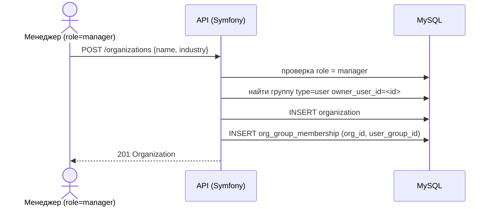
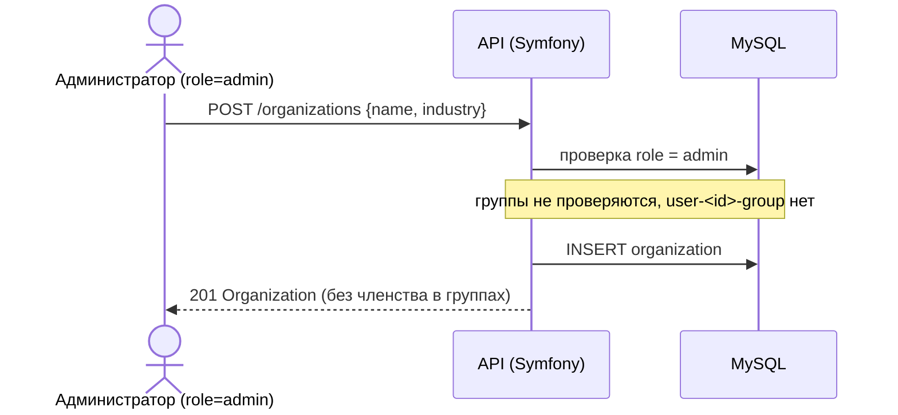
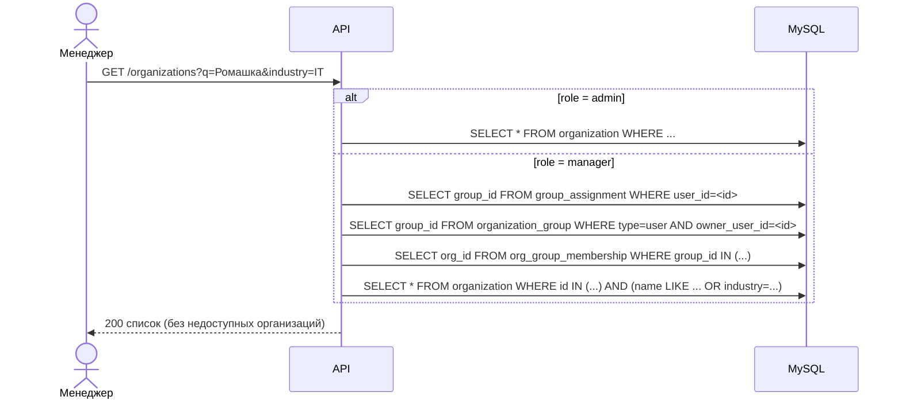
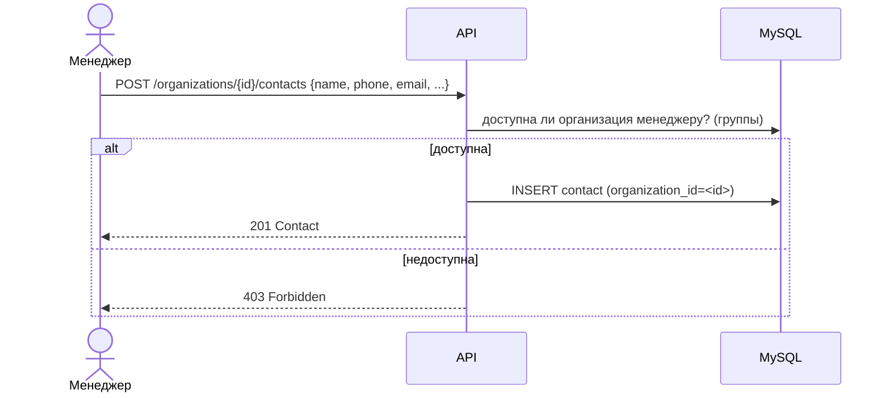
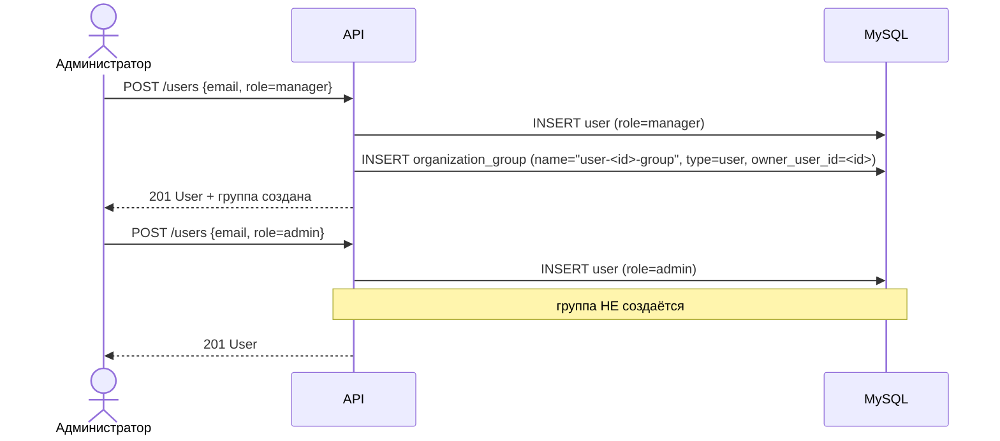
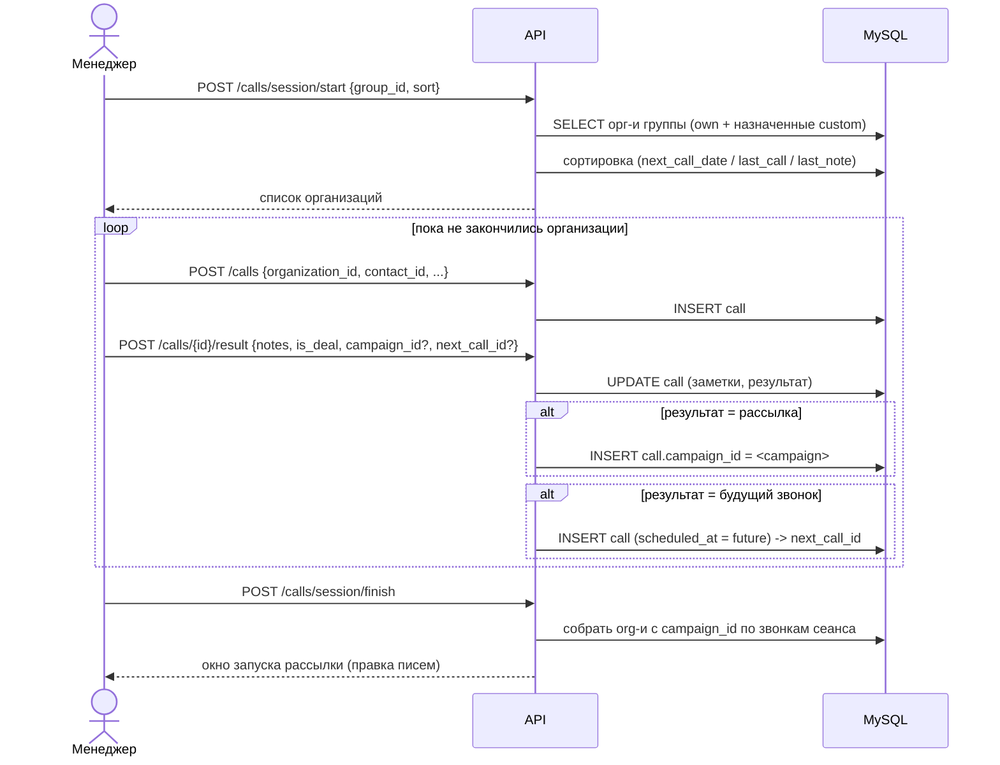
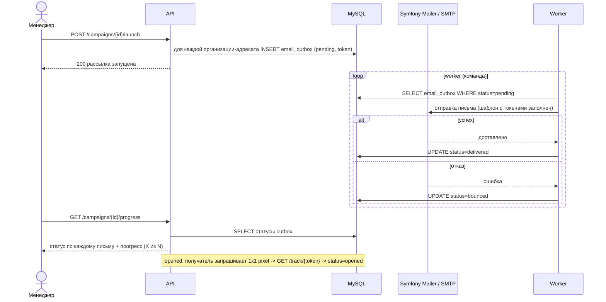

# Sequence-диаграммы (ядро: организации + контакты + обзвон + рассылки)

Сгенерировано из спецификаций `organizations`, `contacts`, `calls`,
`campaigns`, `organization-groups`, `access-control`. Диаграммы проверяют, что
каждый Scenario выводим без придумывания деталей.

## 1. Создание организации менеджером → попадание в user-<id>-group

## 2. Создание организации администратором (группы не проверяются)

## 3. Поиск организаций по названию/отрасли (область доступа)

## 4. CRUD контакта в карточке организации

## 5. Создание менеджера → автосоздание user-<id>-group

## 6. Сеанс обзвона по группе организаций

## 7. Запуск рассылки и отправка через outbox

## Сверка со сценариями

| Spec (Requirement) | Покрытие |
|---|---|
| organizations: создание/обновление/удаление | диаграммы 1–2 |
| organizations: поиск по названию и отрасли | диаграмма 3 |
| contacts: добавление/обновление/удаление | диаграмма 4 |
| organization-groups: автосоздание группы менеджера | диаграмма 5 |
| organization-groups: admin не имеет группы | диаграммы 2, 5 |
| access-control: видимость менеджера/админа | диаграммы 2, 3 |
| calls: сеанс обзвона, результат, завершение | диаграмма 6 |
| campaigns: launch, outbox, статусы + opened | диаграмма 7 |

## Open questions

1. Slug custom-группы: генерируется автоматически из имени или вводится
   администратором вручную? (в сценарии указан явно)
2. Удаление организации: каскадное удаление контактов или soft-delete?
   (в спеках не оговорено)
3. Сеанс обзвона: список фиксируется на старте или пересчитывается при
   каждом шаге (например, если просроченные звонки добавляются динамически)?
4. `next_call_id` и `scheduled_at` будущего звонка: создаётся один `Call` сразу
   (в одном POST) или результат сначала сохраняется, потом создаётся новый?
   Рекомендация: одной транзакцией, чтобы `next_call_id` не висел без цели.